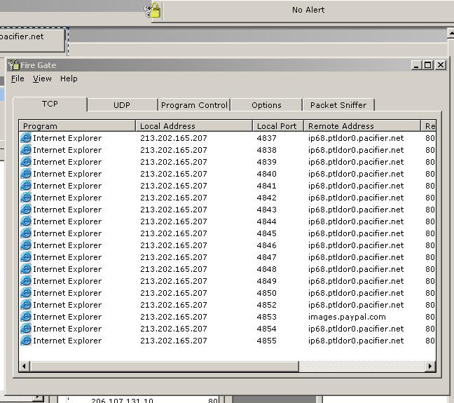

<div align="center">

## FireGate \- 100% Pure VB FireWall \(Working\)


</div>

### Description

Sorry about the lateness of this upload, I meant to upload it the same week as my last post but things got a little delayed. This upload comes to you courtesy of Tom Smith who helped me out with the AllocateAndGetTCPExTable API Call. Firstly !!! - NOTE: ONLY WORKS ON WINDOWS XP - !!!. Now thats out of the way, once you download the zip, read the ReadMe.txt file located in the zip. There are alot of nifty extra's added to this application such as the Hex Viewer in the Packet Sniffer and the IP Info Dialog in Right Click->View Information menu menu. Please look at the entire submission before voting !!! And also, leave all comments good or bad so I can review and update the submission as needed. Sometimes the first time you run it, IDE or compiled, it errors, just close it and open it again. I think its because of the way I use Threads. Also, if it starts to lag, Check the "Dont Resolve Hostnames" checkbox in the options dialog, this slows it down alot on Dialup anyway.

Download MThreadVB here - http://www.eliteprodigy.com/MThreadVB.dll , or view the submission here - http://www.Planet-Source-Code.com/vb/scripts/ShowCode.asp?txtCodeId=26900&lngWId=1
 
### More Info
 


<span>             |<span>
---                |---
**Submitted On**   |2003-11-01 13:13:00
**By**             |[c0ldfyr3](https://github.com/Planet-Source-Code/PSCIndex/blob/master/ByAuthor/c0ldfyr3.md)
**Level**          |Intermediate
**User Rating**    |5.0 (15 globes from 3 users)
**Compatibility**  |VB 6\.0
**Category**       |[Complete Applications](https://github.com/Planet-Source-Code/PSCIndex/blob/master/ByCategory/complete-applications__1-27.md)
**World**          |[Visual Basic](https://github.com/Planet-Source-Code/PSCIndex/blob/master/ByWorld/visual-basic.md)
**Archive File**   |[FireGate\_\-1667481142003\.zip](https://github.com/Planet-Source-Code/c0ldfyr3-firegate-100-pure-vb-firewall-working__1-49660/archive/master.zip)

### API Declarations

```
Private Declare Function AllocateAndGetTcpExTableFromStack Lib "iphlpapi.dll" (ByRef pTcpTable As Any, ByVal bOrder As Boolean, ByVal heap As Long, ByVal zero As Long, ByVal Flags As Long) As Long
Private Declare Function AllocateAndGetUdpExTableFromStack Lib "iphlpapi.dll" (ByRef pUdpTable As Any, ByVal bOrder As Boolean, ByVal heap As Long, ByVal zero As Long, ByVal Flags As Long) As Long
```


